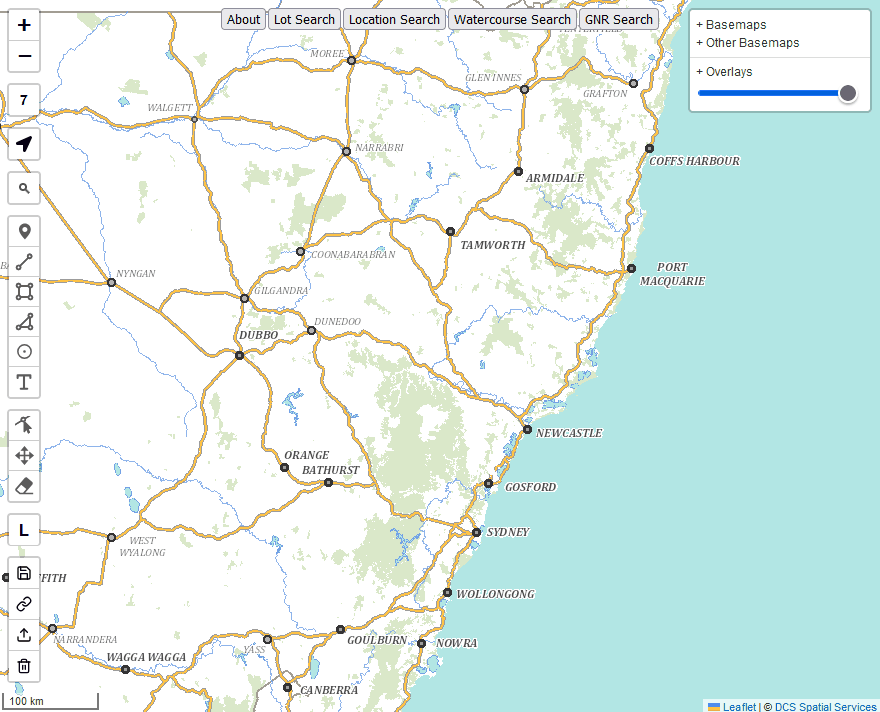
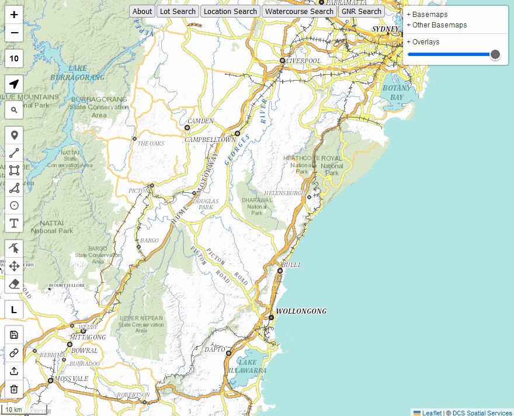

# Bushwalkers Topos
An interactive map designed for bushwalkers in NSW, combining 100+ layers into the one place!

[Try it out here](https://bushwalkingmaps.com)

Powered by [Leaflet](leafletjs.com)

Got feedback or want to see something new? Raise an [issue](https://github.com/gangerang/bushwalkers-topos/issues/new/choose) or send me an email via ajallchin at gmail

## Layer and feature demos
Below are short gif recordings showing the various layer and features which are available
(They might take a while to load)

### Basemaps

### Other basemaps

### Historic topos

### Parish

### Other historic

### Topo downloads

### Topography

### Vegetation

### Fire

### Geology

### Features

### Trigs

### Boundaries

### Government

### Crown lands

### Historic imagery photos

### Historic imagery

### Strava

### Weather

### Planning
(to document)

### Drawn features

### Grids

### Search

### Canyons

## change log
### v0.1
- modify - trig station layer - add survey sketch link to trig station pop up and additional 
- modify - trig, parish, ga photos layers - add minzoom levels to prevent loading too many features
- add - about button - new button which links to github repo
- add - npws all managed land layer - new layer for all npws managed land, not just reserves
- add - gov property ex crown layer - new layer based on existing government property index layer, removing crown land lots
- add - government property layers - pop up on both gpi layers to give lot details
- add - fcnsw estate layer - new layer for all forestry corp estate, including state forest, flora reserves and other managed estate
- add - crown land layer popups - new popups for crown land layers (except 'all')
- add - crown land under disposal layer - new layer for crown land which has a current disposal action
- add - stream gauge esri layer - new layer and popup for stream gauge river height from esri filtered on australia only
- add - nsw stream gauge geojson layer - new layer and popup for stream gauge river height in nsw, based on bom processed data stored on github pages as geojson
- add - nsw stream gauge geojson file creation - via github actions, automation to create the dataset which is then referenced as a layer
- add - nsw historic aerial imagery layers - new raster layers for historic aerial imagery in nsw. 34 layers between years 1943 to 2013
- add - schedule 1 and 2 catchment layers - new vector layers from geojsons for waternsw schedule 1 and 2 catchment boundaries

### v0.2
- add - fesm fire layers - new fire extent and severity mapping layers for nsw, 2016-2024
- add - osm basemap - new OpenStreetMap basemap sourced via OpenFreeMap.org
- add - additional boundaries - new boundary layers for suburb, lga, state seats and federal seats, for nsw
- add - OpenTopoMap basemap - new OpenTopoMap basemap which is based on OSM data but styled as a topographic map with hillshade, souced via opentopomap.org
- add - ESRI OSM basemap - new OSM basemap sourced via ESRI vector tiles
- add - OSM seach function - new search tool which returns results from OSM for Australia. Uses leaflet-geosearch plugin and OSM Nominatim api
- add - NSW vector topo basemap - new basemap for NSW spatial services vector tile topo map. Combined with esri hillshade
- add - Sydney historic imagery photos - new layer for historic imagery points for sydney. A subset of the NSW dataset from Spatial Services served as a geopackage
- add - Crown road sales - new layers for proposed crown road sales, both current and past
- add - authenticated strava heatmap layers - based on authenticated data served via a proxy, providing a higher resolution to public version
- add - 1912 trig progress map - historic map of trig survey progress as of 1912, via georeferenced map from NLA served via geoserver
- add - 100k topo maps - older topo maps from ga at 100k scale. tiffs stiched seamlessly and served via geoserver
- add - 50k topo maps - older topo maps from ga at 50k scale. tiffs stiched seamlessly and served via geoserver
- add - weather radar layer - from rain viewer, rain radar weather layer for most recent observations
- add - NSW historic imagery photos - replaces the sydney only layer, served via geoserver
- add - improve usability on mobile - when viewing on a small screen, basemaps and layers selectable via a popup modal instead of tree
- add - port hacking tourist 1966 - tourist map of port hacking from 1966, served via geoserver
- add - bruces walk 1931 map - tourist map of bruces walk from 1931, served via geoserver
- add - ssc historic aerial layers - historic aerial layers of sutherland shire council from 1930 to 2010
- add - nsw spot imagery - basemap from spot satellite of aerial imagery for nsw. from 2020 so shows fire extent
- add - nsw fires - fire boundaries from 'near real time bushfire boundaries' featureservice
- add - dea hotspots - fire hotspots from ga dea product. shows fire detection from satellite imagery from last 3 days
- add - sentinel 2 basemaps - latest sentinel 2 imagery via esri. at worst, 5 days old. both colour and short wave infrared
- add - feature drawing - using geoman, ability to add features to a map such as points, lines and text
- add - geojson import and export - ability to import or export drawn features to a geojson file
- add - gnb proposals - layer with gnb proposed placenames
- add - share via link - save drawn or loaded geojson to a link which can be shared and accessed again via the link
- add - amg66 and ang grids - utm grid for amg66 datum and approximate 'australian national grid' (ang), pre amg66. 
- add - lalc boundaries - boundary layer for local aboriginal land councils
- add - getlost maps features - sourced from getlost maps, points features for huts, ruins and repeaters acorss australia
- add - elvis elevation index - index layer for elvis dem and elevation product availability
- add - government lands - based on features controlling authority in cadastre layers
- add - planning - layers for zoning, minimum lot size and land accuisitions in nsw
- add - planned hr burns - layer for planned hazard reduction burns in nsw
- add - byo layers - ability to bring your own layers defined via a json file
- add - ga placenames - layer for ga placenames, sourced from ga gazetteer
- add - dunphy gangerang - historic gangerang dunphy sketch map served via geoserver
- add - scims marks - all scims survey marks as a mapserver layer
- add - qld qtopo basemap - new qtopo basemap for queensland topo maps, sourced from qld government
- add - terrarium elevation - global mapzen elevation tiles via aws s3. 90m resolution via SRTM for majority of australia 
- add - multiscale tpi - ga multiscale topographic position index layer, showing various landforms as different colours across australia
- remove - strava auth layers - removed as strava authenticated service is not currently working
- add - 1905 sydney tramways - new nla map search layer for 1905 sydney tramways
- add - 1912 proposed railways - new nla map search layer for proposed railways in sydney in 1912
- add - declared wilderness - previously had identified wilderness (incorrectly called declared wilderness), now added declared wilderness layer
- add - light pollution - global light pollution layer from djlorenz light pollution atlas
- add - nsw tenure - raster layer for land tenure in nsw, shows private, crown land, national parks, state forest and aboriginal owned land
- add - npws access trails - raster layer for access trails in nsw national parks
- add - caltopo layers - caltopo basemap and slope layers
- add - byo layers via url - ability to add byo layers via a url parameter 'byo', for easier sharing of custom maps
- add - mobile coverage layers - telstra, optus and tpg mobile coverage for australia based on 2024 data from accc
- add - forestry operations - new layer for forestry corporation of nsw planned logging operations
- add - ga land cover layers - new layers for australian land cover from ga landsat data, for years 1988 and 2024
- add - basemaps to overlays - all basemap layers are now also available as overlay layers so they can be used with opacity
- add - sanddune hillshade - new hillshade layer for nsw from sanddune.dev, based on 5m elevation data for nsw
- add - sanddune osm - new basemap layer for sanddune osm styled map, based on openstreetmap data
- add - sanddune contours - new contour layer for nsw from sanddune.dev, based on 5m elevation data for nsw
- add - ibra7 subregions - new layer for ibra7 subregions
- add - property layer - new layer for property boundaries, being those comprised of one or more lots